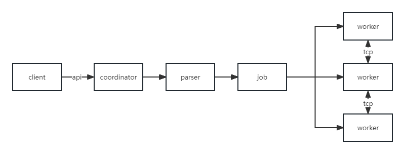

# gotodb
Distributed SQL query engine written in Go for any storage.

Now, support query from csv, http, mysql.

It means your can perform a sql like this.

`
 select id from mysql.db.table join file.csv.dir on mysql.id = csv.id
`

`
insert into mysql.db.table select * from file.csv.dir
`

Like presto or trino written in go, enjoy it.

## Diagram

## Use
1. kubectl apply -f ./k8s.yaml

or

1. cp config.example.yaml config.yaml
2. go run ./cmd/coordinator/main.go -c config.yaml
3. go run ./cmd/worker/main.go -c config.yaml

`
curl --header "Content-Type: application/json" \
--request POST \
--data '{"sql": "select * from test.test.csv"}' \
http://gotodb:8001/query
`

## Develop

1. create your own config in ./config dir
2. create your own connector in ./connector dir

## Contribute

[Issue](https://github.com/gotodb/gotodb/issues/new) 

## License

[GPLv3](LICENSE) © zhenorzz